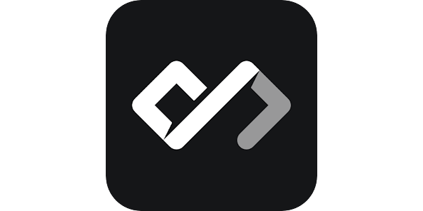

  <h1>👋 Welcome to my GitHub! 👋</h1>
  
    
  <!-- I love these gifs so much -->
  

---

<h1 align="left">Who are you?</h1>

  

    Hello! I'm <strong>Freesia</strong>, and this is my university-based GitHub account (it's new!) 
    I'm a Quantum Engineering student at UNSW, but find coding on the side fun. 
    You may find occasional projects here going into the future, either transferred from   my older page or new work.
  

<h2 align="left">📬 Catch me on the web! 📬</h2>

  
  

<h3 align="left">(... or watch my contribution graph get eaten by a snake! :) 🐍 )</h3>

<!-- add dark mode when bothered -->

---
## 🥞 The Stack (+ other hobbies)

### Programming Languages & Tools

  
  
  
  
  
  
  
  

📚 Working On:

  
  
  

---

### Backend & DevOps

    
    
    
    

📚 Working On:

    
    

---

### Hardware & IoT

    
    

📚 Working On:

    
    
    

---

### Frontend Development

    
    (I need to work on this 😵)

---

### 3D Printing & Design

    
    
    
    
    (On a bit of a hiatus)

---

### PCB Design (Still have a ways to go to call myself 'good' here 😆)

    
    

---

### OS's (Locally)

    
    
    
    
    

### Quantum 

    
    
    
      (Used these under the context of Quantum work)  
    
    

---

